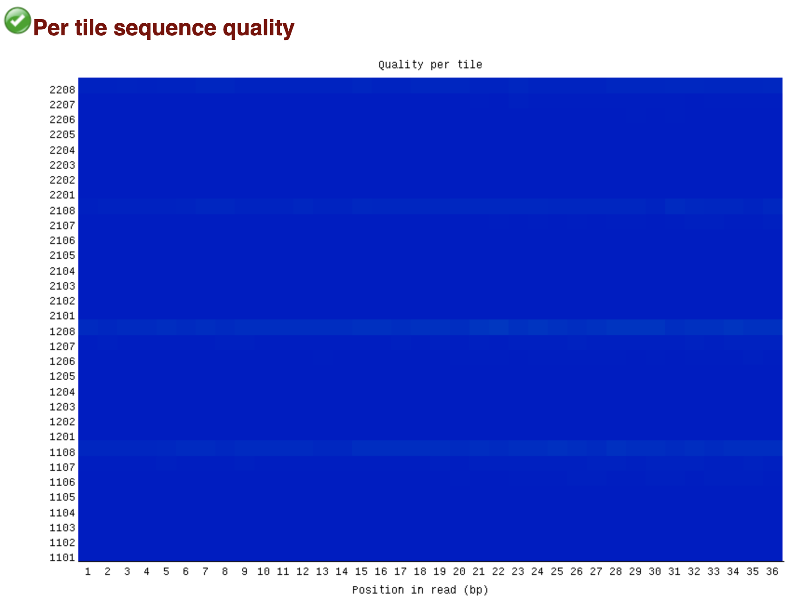
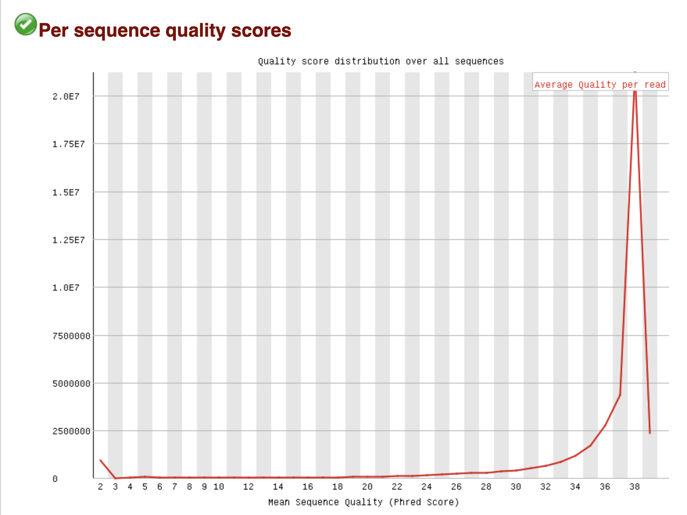
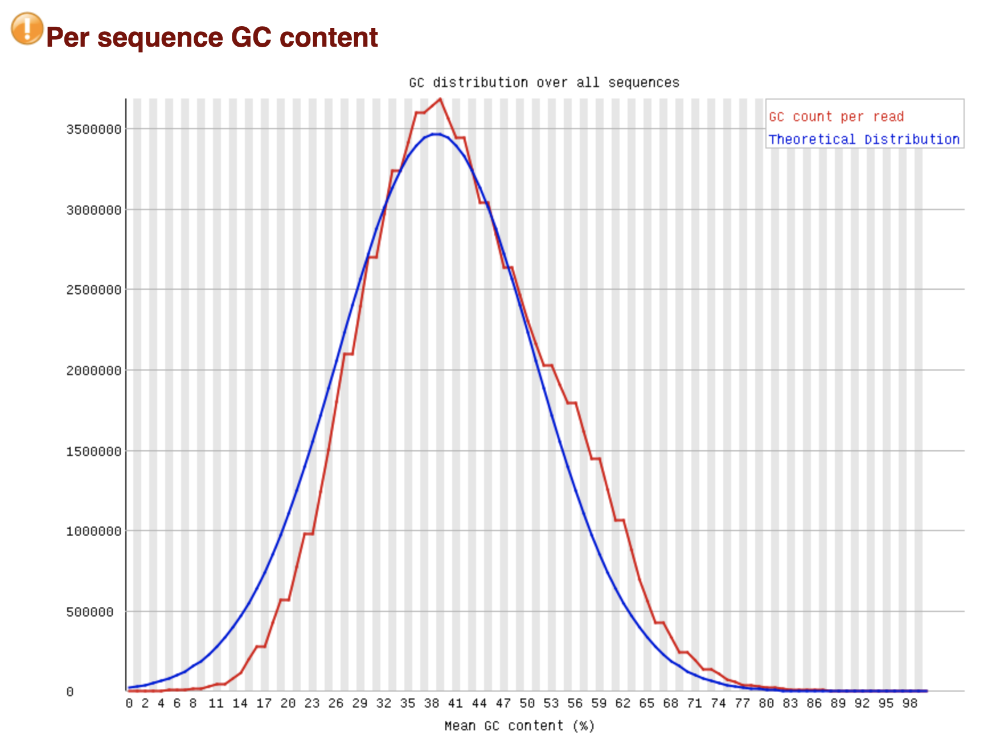

# hse_hw2_chip
## Бордюгов Максим, группа 1
Colab: https://colab.research.google.com/drive/1nMRbmbMQ0rnkL9z_vVosOAB414bvtecG?usp=sharing
- Клеточная линия: A549
- Гистоновая метка: H3K4me1
- Эксперимент: https://www.encodeproject.org/experiments/ENCSR000AVH/

| | ENCFF000AIT | ENCFF000AIS | ENCFF000AHJ |
| :---: | ---: | ---: | ---: |
| Per base sequence quality |  |  |  |
| Per sequence quality scores |  |  |  |
| Per base sequence content |  |  |  |
| Per sequence GC content |  |  |  |
| Sequence Duplication Levels |  |  |  |
| Общее количество ридов |40417850 | 35671032 | 38269770 |
| Не выровнилось | 33802975 | 29703964 | 31293422 |
| Не выровнилось (в процентах) | 83.63% | 83.27% |81.77% |
| Выровнилось уникально | 2273997 | 1750514 | 1874146 |
| Выровнилось уникально (в процентах) | 5.63% | 4.91% | 4.90% |
| Выровнилось больше 1 раза | 4340878 | 4216554 | 5102202 |

Дополнительное считается в colab