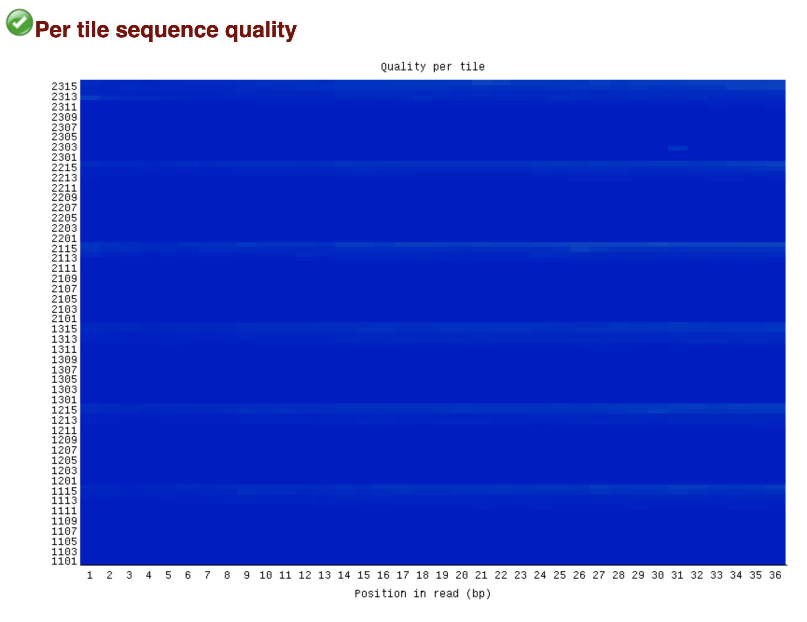

# hse_hw2_chip
## Бордюгов Максим, группа 1
Colab: https://colab.research.google.com/drive/1nMRbmbMQ0rnkL9z_vVosOAB414bvtecG?usp=sharing
- Клеточная линия: A549
- Гистоновая метка: H3K4me1
- Эксперимент: https://www.encodeproject.org/experiments/ENCSR000AVH/

|                                         | ENCFF000AIT                            | ENCFF000AIS                            | ENCFF000AHJ                            |
| :-------------------------------------: | -------------------------------------: | -------------------------------------: | -------------------------------------: |
| Per base sequence quality               |  |  |  |
| Per tile sequence quality               |  |  |  |
| Per sequence quality scores             |  |  |  |
| Per base sequence content               |  |  |  |
| Per sequence GC content                 |  |  |  |
| Per base N content                      |  |  |  |
| Sequence Duplication Levels             |  |  |  |
| Adapter Content                         |  |  |  |
| __Общее количество ридов__              | 40417850                               | 35671032                               | 38269770                               |
| __Не выровнилось__                      | 33802975                               | 29703964                               | 31293422                               |
| Не выровнилось (в процентах)            | 83.63%                                 | 83.27%                                 | 81.77%                                 |
| __Выровнилось уникально__               | 2273997                                | 1750514                                | 1874146                                |
| Выровнилось уникально (в процентах)     | 5.63%                                  | 4.91%                                  | 4.90%                                  |
| __Выровнилось больше 1 раза__           | 4340878                                | 4216554                                | 5102202                                |
| Выровнилось больше 1 раза (в процентах) | 10.74%                                 | 11.82$                                 | 13.33%                                 |

Дополнительное считается в colab

__Ответы на вопросы__:
- _Почему процент выравниваний получился именно таким?_  
Процент выравнивания получился низний из-за того что выравнивание проводилось только на одну хромосому.
- _Проанализируйте полученные результаты. Как можно объяснить различия в количестве пересечений?_  
Из-за выравнивания на одну хромосому число пиков довольно маленькое. Поэтому пересекающихся участков тоже мало. Количество пересечений считается как число пиков в одном файле, которые встретились в другом ( и наоборот). Из-за этого и получаются разные значения.